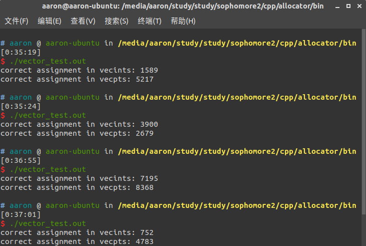
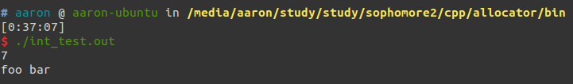

# Allocator+memory pool
*Made By Aaron*

---
- **实验平台**：ubuntu18.04
- **编译版本**：g++ (Ubuntu 5.5.0-12ubuntu1) 5.5.0 20171010
- **实现标准**：C++17

---
- **文件说明**：
1. allocator文件夹内包含两个子文件夹，以及本README说明文件。
2. 其中，src文件夹下包含实现的allocator源代码头文件mpallocator.h，以及模板定义文件mpallocator.tcc。main.cpp，main1.cpp，main2.cpp都为测试文件，makefile文件为编译文件。
3. 其中，bin文件夹下包含三个测试样例文件的输出结果程序，分别为main.cpp生成的vector_test.out，main1.cpp生成的int_test.out，main2.cpp生成的int_test2.out。

---
- **代码说明**：
1. 本代码采用c++17标准模板完成，所有type和function均参照该标准说明及库函数完成。
2. 本代码实现allocator使用memory pool进行优化，时间效率方面会有一定程度提升。
3. 本代码部分未涉及memory pool部分参考标准库中的allocator实现，诸如操作符==，！=的重载。
4. 本代码的allocate函数支持申请参数_Count为电脑可用内存允许范围内的任意大小，会返回一段指定大小的连续空间。
5. 本代码会在析构函数销毁所有申请得到的空间，包括memory pool以及allocate中可能存在的过大直接从内存中申请得到的空间，以及freesequence中申请得来的空间。
6. 本模板中的Blocksize根据个人电脑内存情况进行大小调整，目前该默认大小在8g内存电脑ubuntu系统下可正常运行，若改为65536可在16g内存mac os系统下正常运行，windows本身内存占用过多，故测试较大内存请求时较为困难。

---
- **使用方法**：
1. include"mpallocator.h"即可使用MPAllocator<template <typename _Ty, size_t BlockSize>类型模板，其中BlockSize设置了defau值，根据测试样例以及个人电脑内存情况调整。
2. 提供三个测试样例，main.cpp来自于PTA上给出的测试代码，因为该代码对内存要求较高，推荐在8g以上内存电脑linux或mac os环境运行，windows本身内存占用过多，内存请求处理可能出现malloc的异常；main1.cpp则来自于c++官方allocator页面的测试样例，覆盖了所有内部函数的测试；main2.cpp则是对main1.cpp中的参数调大，用于测试allocator的性能而设置的。
3. 测试样例可直接在src文件下使用make编译，或者linux环境下在bin文件夹内直接使用.out文件。

---
- **输出实例**：
1. vector_test.out（main.cpp）（使用random函数故记录四次结果作为采样）:
   
2. int_test.out（main1.cpp）:
   
3. int_test2.out（main2.cpp）(与前者输出相同)：
   

---